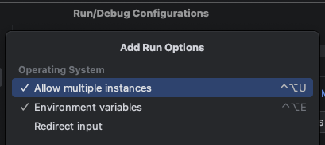
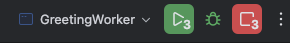
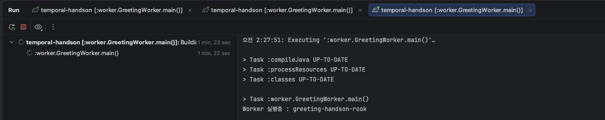
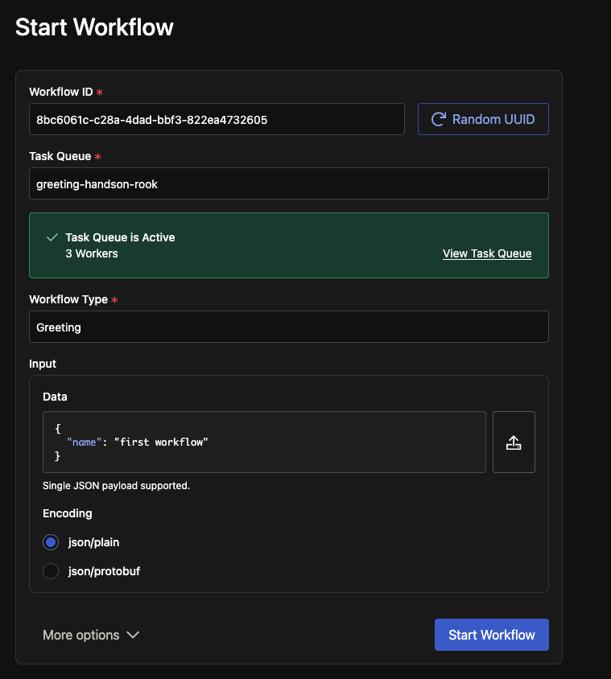
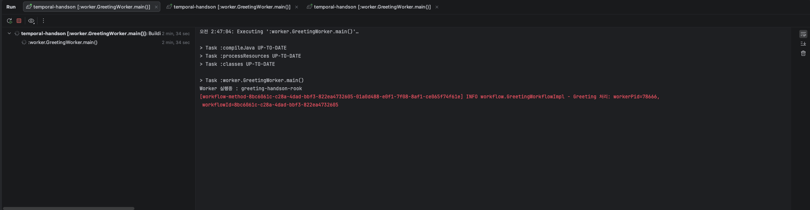
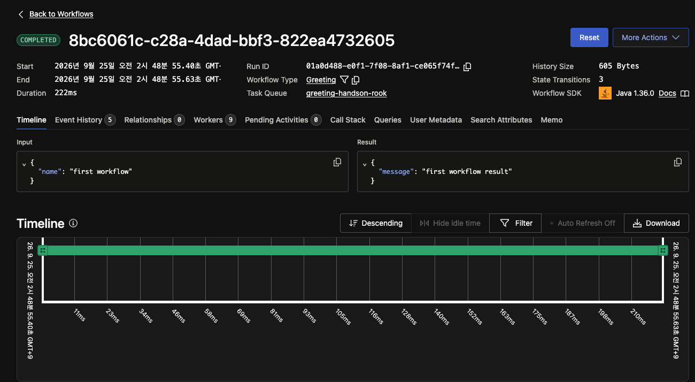
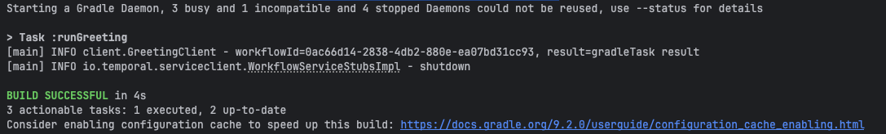
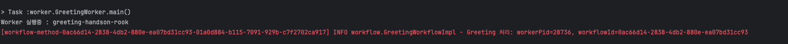

# Docker Compose

Temporal 서버를 기동합니다.

```sh
docker compose up -d
```

# IntelliJ 실행 설정

Worker를 여러 개 실행하려면 **Allow multiple instances**를 체크합니다.



### Step 1

Worker 를 3개 실행합니다.





http://127.0.0.1:18233/namespaces/handson/workflows 웹 페이지를 확인합니다. Start Workflow 를 누릅니다.



실행하고 나면 3개중 워커중 한 곳에 로그가 찍히게 됩니다.



웹도 확인할 수 있습니다.


### Step 2

```aiexclude
./gradlew runGreeting --args="gradleTask"
```
Client 코드 실행결과



Worker 결과 확인


